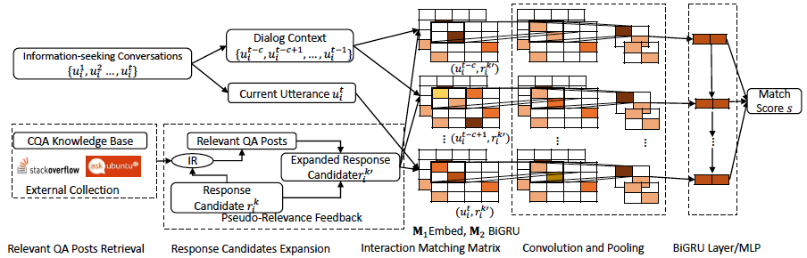
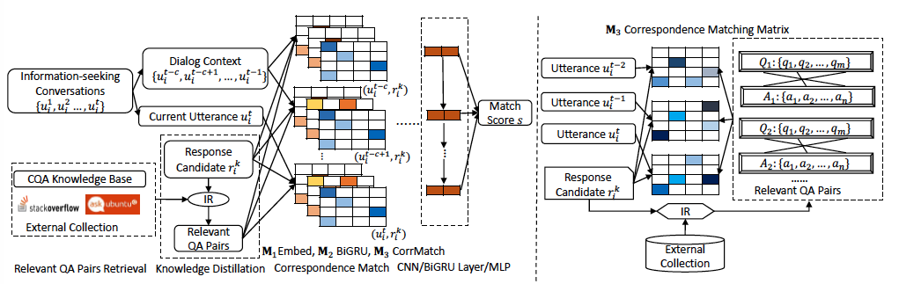

# NeuralResponseRanking

This repository contains the implementation of DMN/DMN-PRF/DMN-KD models proposed in SIGIR'18 paper
[Response Ranking with Deep Matching Networks and External Knowledge in Information-seeking Conversation Systems](https://arxiv.org/abs/1805.00188).
The implementation of DMN/DMN-KD/DMN-PRF models is based on [MatchZoo](https://github.com/faneshion/MatchZoo).
We will maintain the SIGIR'18 experiments related code in this code repository and merge the implementation of
DMN/DMN-PRF/DMN-KD models into the master branch of [MatchZoo](https://github.com/faneshion/MatchZoo) later.

If you use this code for your paper, please cite it as:

```
Liu Yang, Minghui Qiu, Chen Qu, Jiafeng Guo, Yongfeng Zhang, W. Bruce Croft, Jun Huang, Haiqing Chen. Response Ranking
with Deep Matching Networks and External Knowledge in Information-seeking Conversation Systems. In Proceedings of the
41th International ACM SIGIR Conference on Research & Development in Information Retrieval (SIGIR 2018).

Bibtext
 @inproceedings{InforSeek_Response_Ranking,
	author = {Yang, L. and Qiu, M. and Qu, C. and Guo, J. and Zhang, Y. and Croft, W. B. and Huang, J. and Chen, H.},
	title = {Response Ranking with Deep Matching Networks and External Knowledge in Information-seeking Conversation Systems},
	booktitle = {SIGIR '18},
	year = {2018},
}
```

## Requirements

* python 2.7
* tensorflow 1.2+
* keras 2.06+
* nltk 3.2.2+
* tqdm 4.19.4+
* h5py 2.7.1+

We also recommend to use GPU (NVIDIA TITAIN X for our experiments) for model training efficiency. In general, the model training time for [Ubuntu Dialog Corpus](https://arxiv.org/abs/1506.08909) is longer than that of [MSDialog](https://ciir.cs.umass.edu/downloads/msdialog/) due to the larger training data size.

## Guide To Use

### DMN
---

<p align="center">

</p>

#### Data Preparation and Preprocess ####

We take the [Ubuntu Dialog Corpus](https://arxiv.org/abs/1506.08909) as the example data to show how to prepare and preprcess the data
to run the DMN model for experiments on response ranking in information-seeking covnersations. You can easily adapt these instructions
to other data sets like [MSDialog](https://ciir.cs.umass.edu/downloads/msdialog/) or other information-seeking conversation datasets
in your lab or company.

* Step 1: Download the data. you can download the Ubuntu Dialog Corpus(UDC) data from
[this dropbox link](https://www.dropbox.com/s/2fdn26rj6h9bpvl/ubuntu%20data.zip?dl=0) used
in several [previous papers](https://arxiv.org/abs/1612.01627) and our
[SIGIR'18 paper](https://arxiv.org/abs/1805.00188).
The data contain 1M train instances, 500K validation instances and 500K testing instances you
need for the response ranking experiments. The data format is as follows:

```
label  \t   utterance_1   \t   utterance_2    \t     ......    \t    candidate_response
```

Each line is corresponding to a conversation context/candidate response pair.
Suppose there are n_i columns seperated by tab in the i-th line. The first column
is a binary label to indicate whether the candidate response is the positive candidate
response returned by the agent or the sampled negative candidate response. Then the
next (n_i - 2) columns are the utterances in the conversation context including the
current input utterance by the user. The last column is the candidate response.

After you downloaded the files, put train.txt/valid.txt/test.txt under NeuralResponseRanking/data/udc/ModelInput/ .
The suggested directory structure under NeuralResponseRanking/data/ is as follows:
```
.
├── ms_v2
│   ├── ModelInput
│   │   ├── dmn_model_input
│   │   └── dmn_prf_model_input_body
│   └── ModelRes
└── udc
    ├── ModelInput
    │   ├── dmn_model_input
    │   └── dmn_prf_model_input_body
    └── ModelRes
```

where dmn_model_input stores the preprocessed input data of DMN/DMN-KD model and dmn_prf_model_input_body stores
the preprocessed input data of DMN-PRF model. ms_v2 refers to [MSDialog](https://ciir.cs.umass.edu/downloads/msdialog/)
data and udc refers to  [Ubuntu Dialog Corpus](https://arxiv.org/abs/1506.08909)  data.

* Step 2: Preprocess the data. You can run the follow commands to preprocess the data.
The preprocess steps include preparing the data into relation files and corpus files
required in [MatchZoo](https://github.com/faneshion/MatchZoo) toolkit. Then the script
will perform word tokenization, word stemming, transferring words into lower cases,
computing word statistics like term frequency, filtering words that appear less than
5 times in the whole corpus, transferring words to word indexes and building a word
dictionary.

```
cd matchzoo/conqa/
python preprocess_dmn.py udc
```

If you pass ms_v2 into preprocess_dmn.py, it can also do preprocessing steps for [MSDialog](https://ciir.cs.umass.edu/downloads/msdialog/)
 data. You need to download the data in advance.

* Step 3: Prepare the pre-trained word embedding files. As presented in our
[SIGIR'18 paper](https://arxiv.org/abs/1805.00188), we
used the [Word2Vec](https://github.com/dav/word2vec) to pre-train the word embeddings and then update
them during model training process. We found the models achieved better performances with pre-trained
word embeddings by [Word2Vec](https://github.com/dav/word2vec) comparing with using
[Glove](https://nlp.stanford.edu/projects/glove/) as pre-trained word embeddings. We wrote a python
wrapper to call the compiled Word2Vec toolkit to train word embeddings with different dimensions.
You can run

```
cd matchzoo/conqa/
python gen_w2v_mikolov.py udc 0 dmn_model_input
```

It takes several minutes to train the word embedding file based on the corpus file of UDC data. After that
you needs to filter the generated word embedding file by the words in the word dictionary file. We are only
interested in word embeddings corresponding to terms left in the corpus after data preprocessing. To achieve
 this, you can simply run

```
cd matchzoo/conqa/
python gen_w2v_filtered_helper.py
```
After these steps you can get the preprocessed train/valid/test relation files, word dictionary file, corpus
file and the pre-train word embedding file under NeuralResponseRanking/data/udc/ModelInput/dmn_model_input/.
Congratulations! You can start model training now.

#### Configuration and Model Files ####
All model configuration files of DMN/DMN-PRF/DMN-KD are in NeuralResponseRanking/matchzoo/config/udc/.
You can find all the default model configuration of the DMN model in dmn_cnn.config. The default hyper-parameters could
be override by the hyper-parameters passed by command lines. The model implementation of DMN model is
matchzoo/models/dmn_cnn.py.

#### Training ####

The script for both training and testing is NeuralResponseRanking/matchzoo/main_conversation_qa.py. The supported
parameters are as follows:


```
$ python main_conversation_qa.py --help
usage: main_conversation_qa.py [-h] --phase PHASE --model_file MODEL_FILE
                               --or_cmd OR_CMD [--embed_size EMBED_SIZE]
                               [--embed_path EMBED_PATH]
                               [--test_relation_file TEST_RELATION_FILE]
                               [--predict_relation_file PREDICT_RELATION_FILE]
                               [--train_relation_file TRAIN_RELATION_FILE]
                               [--valid_relation_file VALID_RELATION_FILE]
                               [--vocab_size VOCAB_SIZE]
                               [--text1_corpus TEXT1_CORPUS]
                               [--text2_corpus TEXT2_CORPUS]
                               [--weights_file WEIGHTS_FILE]
                               [--save_path SAVE_PATH]
                               [--valid_batch_list VALID_BATCH_LIST]
                               [--test_batch_list TEST_BATCH_LIST]
                               [--predict_batch_list PREDICT_BATCH_LIST]
                               [--train_batch_size TRAIN_BATCH_SIZE]
                               [--text1_max_utt_num TEXT1_MAX_UTT_NUM]
                               [--cross_matrix CROSS_MATRIX]
                               [--inter_type INTER_TYPE]
                               [--test_weights_iters TEST_WEIGHTS_ITERS]

optional arguments:
  -h, --help            show this help message and exit
  --phase PHASE         Phase: Can be train or predict, the default value is train.
  --model_file MODEL_FILE
                        Model_file: MatchZoo model file for the chosen model.
  --or_cmd OR_CMD       or_cmd: whether want to override config parameters by command line parameters
  --embed_size EMBED_SIZE
                        Embed_size: number of dimensions in word embeddings.
  --embed_path EMBED_PATH
                        Embed_path: path of embedding file.
  --test_relation_file TEST_RELATION_FILE
                        test_relation_file: path of test relation file.
  --predict_relation_file PREDICT_RELATION_FILE
                        predict_relation_file: path of predict relation file.
  --train_relation_file TRAIN_RELATION_FILE
                        train_relation_file: path of train relation file.
  --valid_relation_file VALID_RELATION_FILE
                        valid_relation_file: path of valid relation file.
  --vocab_size VOCAB_SIZE
                        vocab_size: vocab size
  --text1_corpus TEXT1_CORPUS
                        text1_corpus: path of text1 corpus
  --text2_corpus TEXT2_CORPUS
                        text2_corpus: path of text2 corpus
  --weights_file WEIGHTS_FILE
                        weights_file: path of weights file
  --save_path SAVE_PATH
                        save_path: path of predicted score file
  --valid_batch_list VALID_BATCH_LIST
                        valid_batch_list: batch size in valid data
  --test_batch_list TEST_BATCH_LIST
                        test_batch_list: batch size in test data
  --predict_batch_list PREDICT_BATCH_LIST
                        predict_batch_list: batch size in test data
  --train_batch_size TRAIN_BATCH_SIZE
                        train_batch_size: batch size in train data
  --text1_max_utt_num TEXT1_MAX_UTT_NUM
                        text1_max_utt_num: max number of utterances in dialog context
  --cross_matrix CROSS_MATRIX
                        cross_matrix: parameters for model abalation
  --inter_type INTER_TYPE
                        inter_type: parameters for model abalation
  --test_weights_iters TEST_WEIGHTS_ITERS
                        test_weights_iters: the iteration of test weights file used

```

To start the model training, you can run

```
python main_conversation_qa.py --phase train --model_file config/udc/dmn_cnn.config --or_cmd False
```

Setting "or_cmd" as "False" means you don't want to pass any optional parameter through command lines.
The model will use the default settings in config/udc/dmn_cnn.config. If you want to change the model
hyper-parameters during model training (e.g. hyper-parameters tuning with the validation data), you can
set "or_cmd" as "True" and pass any hyper-parameters you want. In this case, the program will firstly load  hyper-parameters
 from config/udc/dmn_cnn.config. Then it will use the values from command lines to override the values in
 the configuration file.

#### Testing ####

After the model training finished, you will find the stored model weight files under data/udc/ModelRes/,
which is the default setting in config/udc/dmn_cnn.config. To start model testing, you can run
```
python main_conversation_qa.py --phase predict --model_file config/udc/dmn_cnn.config --or_cmd False
```

In the default setting, the program will dump a model weight file in each 10 iterations. You can specify
the iteration number of the weight file you want to use for model testing in the configuration file config/udc/dmn_cnn.config.

### DMN-PRF
---
#### Data Preparation and Preprocess ####
For DMN-PRF, you can still use the same configuration file with DMN. But you need to replace the data path of
train/valid/test relation files, word dictionary file, corpus file and the pre-train word embedding
file to the corresponding files under NeuralResponseRanking/data/udc/ModelInput/dmn_prf_model_input_body.
The differences between DMN-PRF and DMN model are the input files. As presented in Section 3.3 of
our [SIGIR'18 paper](https://arxiv.org/abs/1805.00188), for DMN-PRF model
 you need the following two additional steps before you start model training.

 * Step 1: Relevant QA posts retrieval. We adopt different QA text collections for different conversation data
 (e.g. Stack Overflow data for MSDialog, AskUbuntu for UDC). The statistics of external collections used are
 shown in Table 3 of our [SIGIR'18 paper](https://arxiv.org/abs/1805.00188).
 You can download the data dumps for Stack Overflow and AskUbuntu from [archive.org](https://archive.org/download/stackexchange).
  Then you can index the QA posts in Stack Overflow in most recent two years and all the QA posts in AskUbuntu by 
  [Lucene](http://lucene.apache.org/) . After that you can use the response candidate of each dialog context/response 
  pair as the query to retrieve top 10 QA posts with BM25 as the source for extracting external knowledge. We open sourced 
  our java code for this step under NeuralResponseRanking/retrieval/ for reference.

 * Step 2: Candidate response expansion. The motivation of Pseudo-Relevance Feedback (PRF) is to extract terms from
  the top-ranked documents in the first retrieval results to help discriminate relevant documents from irrelevant
   ones. Given the retrieved top 10 QA posts from the previous step, you can compute a language model. Then you can extract
   the most frequent 10 terms from this language model as expansion terms for response candidate and append them at the
   end of the response candidate. For the query, we performed several preprocessing steps including tokenization, punctuation removal and stop words removal.  QA posts in both Stack Overflow and AskUbuntu have two fields: "Body" and "Title". We choose to search the "Body" field since we found it more effective in our experiments. You can refer to our java code for this step under NeuralResponseRanking/retrieval/ . After this step, you can get the train/valid/test files for DMN-PRF model. The only difference between the train/valid/test files for DMN and DMN-PRF is that there are 10 additional expanded terms at the end of the candidate response in each line for DMN-PRF.

 * Step 3: Preprocess the data. This is similar to what you did for DMN. You can run the following command to start the data
 preprocessing.
 ```
 cd matchzoo/conqa/
 python preprocess_dmn_prf.py udc body
 ```

 * Step 4: Prepare the pre-trained word embedding files. Since you added 10 terms at the end of the each response candiate, the pre-trained word embedding file also needs to be changed. You can still use [Word2Vec](https://github.com/dav/word2vec) to train the word embeddings with the train/valid/test files of DMN-PRF model. You can run

```
cd matchzoo/conqa/
python gen_w2v_mikolov.py udc 0 dmn_prf_model_input_body
```

After that you also needs to filter the generated word embedding file by the words in the word dictionary
file, which is similar to what you did for DMN. After this step, you can start model training for DMN-PRF now.

#### Training ####
To start the model training, you can run

```
python main_conversation_qa.py --phase train --model_file config/udc/dmn_cnn.config --or_cmd True
```
In addition, you need to pass the data path of relation files, word embedding files, corpus files, vocab_size of DMN-PRF through
command lines. We used an internal GPU cluster which uses [Slurm](https://slurm.schedmd.com/) as the cluster management and job
scheduling system for experiments. You can refer to matchzoo/run_submit_jobs_batch_prf.py on how to submit jobs for DMN-PRF model
with passing hyper-parameters you want.

#### Testing ####
After the model training finished, you will find the stored model weight files under data/udc/ModelRes/.
 To start model testing, you can run
```
python main_conversation_qa.py --phase predict --model_file config/udc/dmn_cnn.config --or_cmd True
```
You also need to pass the data path of relation files, word embedding files, corpus files, vocab_size of DMN-PRF through
command lines. Refer to matchzoo/run_submit_jobs_batch_prf.py on how to do this.

### DMN-KD
---
<p align="center">

</p>

#### Data Preparation and Preprocess ####
Comparing DMN-KD with DMN, the main difference is that the CNN of DMN-KD will
run on an additional input channel denoted as blue matrices in the model architecture of DMN-KD,
which captures the correspondence matching patterns of dialog context utterance terms and response
terms in relevant external QA pairs retrieved from the external collection.

* Step 1: Relevant QA pairs retrieval. You can firstly use the
response candidate as the query to retrieve a set of relevant QA pairs from the external collection
[AskUbuntu dump](https://askubuntu.com/), which is similar to what you did for DMN-PRF.

* Step 2: QA term co-occurrence PPMI matrix computation. Given a response candidate and a dialog utterance
 in dialog context, you can compute the term co-occurrence information as the Positive Pointwise Mutual
 Information(PPMI) of words of the response candidate/ dialog utterance pair in retrieved QA pair set. The
 code and documentation for computing this PPMI matrix is under matchzoo/conqa/qa-comatrix/. All the PPMI
 statistics between response candidate/ dialog utterance pairs will be stored in a "qa_comat_file" specified
 in the configuration file of DMN-KD model.

 ```
 "qa_comat_file": "../data/udc/ModelInput/dmn_model_input/qa_comat_local_word.txt"
 ```

* Step 3: Since the input train/valid/test files of DMN and DMN-KD are the same. You can still use the preprocessed
 train/valid/test files of DMN as the input files of DMN-KD. So you can skip the data preprocessing step and word
 embedding pre-training step here. But you need to generate this "qa_comat_file" as the additional input for DMN-KD
 model following the instructions under matchzoo/conqa/qa-comatrix. Then you can start model training and testing of
 DMN-KD model.

#### Configuration and Model Files ####
All model configuration files of DMN/DMN-PRF/DMN-KD are in NeuralResponseRanking/matchzoo/config/udc/.
You can find all the default model configuration of the DMN-KD model in dmn_cnn_kd_word.config. The model
implementation of DMN-KD model is matchzoo/models/dmn_cnn_kd_word.py.

#### Training ####
To start the model training, you can run

```
python main_conversation_qa.py --phase train --model_file config/udc/dmn_cnn_kd_word.config --or_cmd True
```
In addition, you can pass additional hyper-parameters of DMN-KD through command lines.

#### Testing ####
After the model training finished, you will find the stored model weight files under data/udc/ModelRes/.
To start model testing, you can run
```
python main_conversation_qa.py --phase predict --model_file config/udc/dmn_cnn_kd_word.config --or_cmd True
```
In addition, you can pass additional hyper-parameters of DMN-KD through command lines.

### Model Ablation Analysis
---
Our model implementation also supports model ablation analysis of DMN-KD and DMN-PRF models with different
interaction types (dot, cosine or bilinear interaction matrix) and input CNN channels (M1 on word embedding similarity,
M2 on BiGRU representation similarity or M3 on QA correspondence matching matrix), as presented in Table 6 of
our [SIGIR'18 paper](https://arxiv.org/abs/1805.00188). You can
refer to the implementation related to model ablation analysis in matchzoo/models/dmn_cnn_ablation.py,
matchzoo/models/dmn_cnn_kd_ablation.py and matchzoo/run_submit_jobs_model_ablation.py for the details.

### Cite the paper
---
If you use this code for your paper, please cite it as:

```
Liu Yang, Minghui Qiu, Chen Qu, Jiafeng Guo, Yongfeng Zhang, W. Bruce Croft, Jun Huang, Haiqing Chen. Response Ranking
with Deep Matching Networks and External Knowledge in Information-seeking Conversation Systems. In Proceedings of the
41th International ACM SIGIR Conference on Research & Development in Information Retrieval (SIGIR 2018).

Bibtext
 @inproceedings{InforSeek_Response_Ranking,
	author = {Yang, L. and Qiu, M. and Qu, C. and Guo, J. and Zhang, Y. and Croft, W. B. and Huang, J. and Chen, H.},
	title = {Response Ranking with Deep Matching Networks and External Knowledge in Information-seeking Conversation Systems},
	booktitle = {SIGIR '18},
	year = {2018},
}
```

### Acknowledgments
---
The project is developed based on [MatchZoo](https://github.com/faneshion/MatchZoo) toolkit. We also thank the open source
 code of Yu Wu's [SMN model in ACL'17](https://github.com/MarkWuNLP/MultiTurnResponseSelection).

### Questions and Feedback
---
Feel free to post any questions or suggestions on
[GitHub Issues](https://github.com/yangliuy/NeuralResponseRanking/issues)
and we will reply to your questions there. You can also suggest adding new models/features into our
project on neural response ranking in information-seeking conversations. We also created a Google discussion
group [MSDialog Discuss](https://groups.google.com/forum/#!forum/msdialog-discuss) to better
support Q&A discussions of our users. You can post any questions/suggestions on MSDialog data and our project
 here. The developers and other experienced users from our community will reply to your questions.

### Licence
---
MIT


